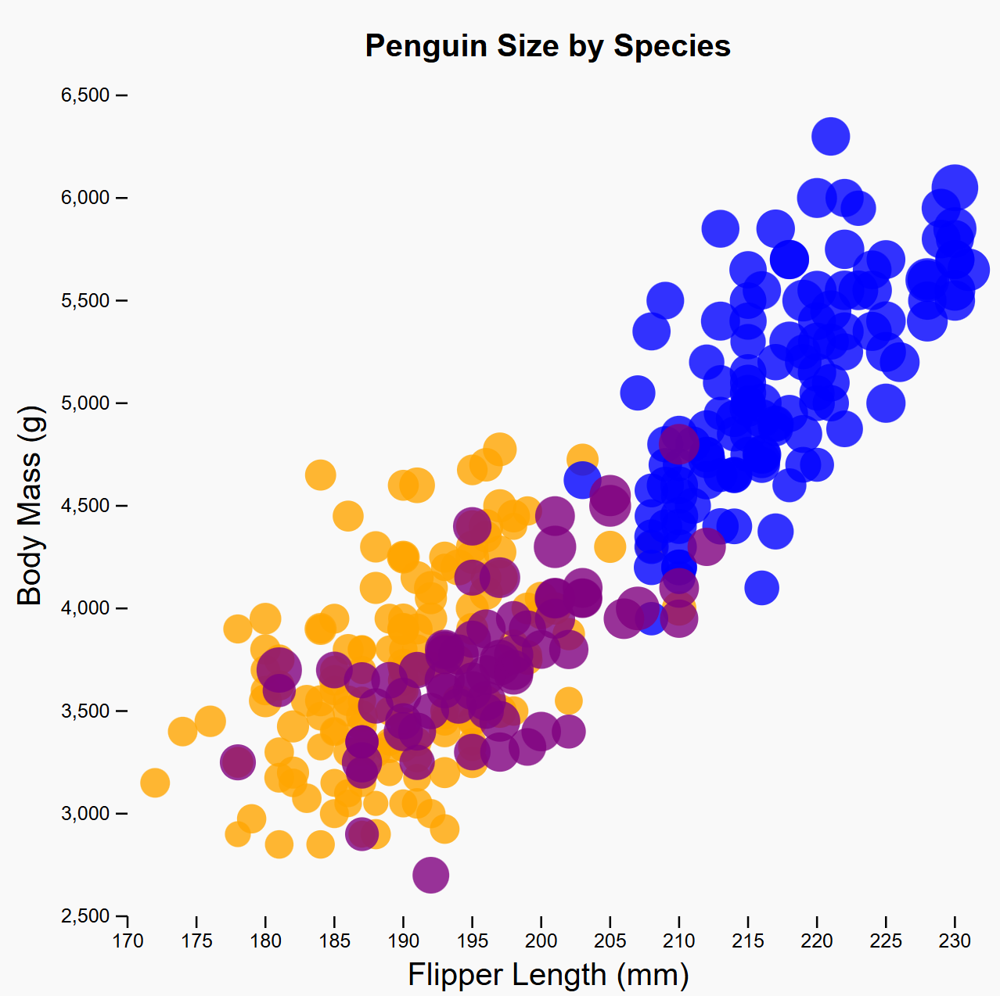
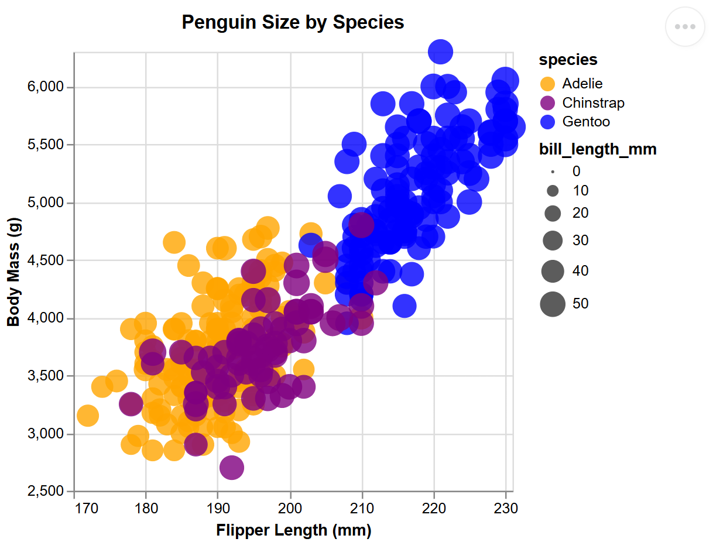

# Assignment 2 - Data Visualization, 5 Ways  
===

## R + ggplot2

Using R and ggplot2 to make the visualization was very straightforward. I have prior experience with R for statistics, but I am certainly rusty and have not used ggplot2 before to my knowledge. Regardless, I found the code quite readable and succinct, and the visualization was one of my favorites. R and ggplot2 did the best job in my option with size mapping for bill_length_mm. To get the right chart, I used "na.strings = "NA"" when loading the data to help the program recognize NA as a null value rather than the string "NA". When running this code, I used RStudio and installed the necessary packages and provided the csv. 

### Technical Achievements
- Efficiently handled missing values using with "na.strings = "NA""

### Design Achievements
- Visualized differences in bill length beautifully using the size of the circles as data points
- Matched the background grid and both legends identically to the original picture
- Added the explanatory title "Penguin Size by Species"

## d3 + HTML + JavaScript

This was the trickiest tool for me as it is the one I am least familiar with. I consulted a number of sources throughout this assignment and benefited most directly from the sources related to d3. It took some work to set up the SVG, scales, and axes correctly--especially because I had to make sure the CSV strings could be read as numbers for the axes and circle sizes. When running this code to check my work, I used GitHub Pages like the class did for the first assignment. In order to do that, I copy and pasted my code from the d3 folder into another file "index.html" in order to fix the problem I had with my README being displayed instead of my d3 visualization. 

### Technical Achievements
- Customized the text anchors for the title and axis labels
- Removed the default axis per suggestion from an article
- Published to GitHub Pages

### Design Achievements
- Programmed my axes to start at 170 x and 2500 y respectively to preserve the scale in the original picture
- Made a clean visualization by removing unnecessary marks and using an opacity of 0.8 to increase readability
- Added the explanatory title "Penguin Size by Species"

## Python + Altair

Though I have not used Altair before, this combination was the easiest programming of them all given experience with Python. The most difficult part was just learning how Altair specifically prefers its formatting. Altair's legends are my favorite of the visualizations, so tasks that require them could certainly benefit from the tool. When running this code, I made an Anaconda environment and used Jupyter notebook.

### Technical Achievements
- Ensured the x domain started at 170 and the y at 2500 to match the original image using scale=alt.Scale(domainMin=170)

### Design Achievements
- Included clear and detailed legends for both attributes
- Avoided overplotting by using a lower opacity
- Added the explanatory title "Penguin Size by Species"

## Datawrapper

Datawrapper was certainly the easiest tool to use of the bunch. It had a simple but detailed user interface that allowed for a surprising amount of customization, though oddly no ability to label axes. I looked into why this is and read an article about it that explained it was an intentional design choice by the team to maximize ink ratio and important information, as what the axes refer to could be communicated in a number of ways. In terms of tricky bits, I did have to make sure the missing data was handled correctly by removing the two items with NA for the majority of their attributes--including the pertinent ones for my visualization. There were other data points that had NA in other columns, particularly in Sex, but this was not a field I explored so it was not an issue. I got my visualization by using Datawrapper's website, then I published my visualization so I could include the link among some HTML code. 

### Technical Achievements
- Published visualization online
- By hovering over a data point, the other members of its species can be isolated and only that species will appear on the visualization briefly

### Design Achievements
- Considered multiple options for legends and decided on the ones that used the least space while still clearly communicating their attribute
- Added the explanatory title "Penguin Size by Species"

## Power BI

I chose to use Power BI for one of my visualizations as I have quite limited experience with it and expect to need to know my way around for my internship this summer. When I had questions as I have barely used the program, it was quite difficult to track down the answers due to multiple versions and the sheer number of buttons. Early on, I experienced a problem with setting up my scatterplot and discovered it was due to Power BI deciding all of my attributes were text-based, instead of the mix of text and numbers that they are. After correcting this error and amending missing values, my scatterplot quickly came to fruition. This tool seemed to have one of the highest capabilities for interactivity, which is certainly where it shines in industry. 

### Technical Achievements
- The data points can be hovered over to reveal detailed information about the specific item
- Individual points can be selected and investigated with the Format tool 

### Design Achievements
- Matched the teal color of the Gentoo species better than other visualizations using blue
- Discovered how and adjusted the circle sizes to be proportional but not overwhelming, as the default illustrated huge circles
- Added the explanatory title "Penguin Size by Species"

### References
I consulted a number of sources as many of these tools were new (or rusty) to me. 
[Map a variable to marker feature in ggplot2 scatterplot](https://r-graph-gallery.com/274-map-a-variable-to-ggplot2-scatterplot.html)

[Comprehensive Guide to Scatter Plot using ggplot2 in R](https://www.geeksforgeeks.org/r-language/comprehensive-guide-to-scatter-plot-using-ggplot2-in-r/)

[Modify axis, legend, and plot labels](https://ggplot2.tidyverse.org/reference/labs.html)

[Scatter charts, bubble charts, and dot plot charts in Power BI](https://learn.microsoft.com/en-us/power-bi/visuals/power-bi-visualization-scatter?tabs=powerbi-desktop)

[Smaller Point Size in the Power BI Scatter Chart](https://dataveld.com/2019/03/31/smaller-point-size-in-the-power-bi-scatter-chart/)

[Simple Scatter Plot with Tooltips](https://altair-viz.github.io/gallery/scatter_tooltips.html)

[Python Altair - Scatter Plot](https://www.geeksforgeeks.org/python/python-altair-scatter-plot/)

[How to Create Interactive Scatter Plots with Altair](https://www.statology.org/how-to-create-interactive-scatter-plots-altair/)

[Mimicking ggplot2 style in d3.js](https://d3-graph-gallery.com/graph/custom_theme.html)

[Why many Datawrapper charts don't include axis labels](https://academy.datawrapper.de/article/239-why-datawrapper-does-not-include-axis-labels-for-many-charts)
